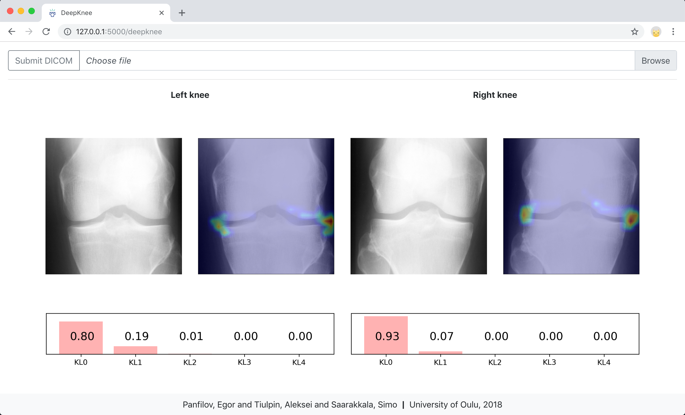

# DeepKnee-web

## Description

Web-service application for automatic __knee localization__ and __osteoarthritis KL-scale grading__ in posteroanterior (PA) X-ray images.



## Installation

0. Before going through the next steps, make sure to install [Conda](https://conda.io/miniconda.html) and [Node.js](https://nodejs.org/en/download/);
1. Clone the repository:

```bash
git clone --recurse-submodules git@github.com:MIPT-Oulu/DeepKnee-web.git
cd DeepKnee-web
```
2. Configure the environment:

```bash
# Create the environment
chmod u+x create_conda_env.sh
./create_conda_env.sh
source activate deep_knee_web

# Install KneeLocalizer
cd src_kneelocalizer
pip install .
cd ..

# Install DeepKnee
cd src_deepknee
pip install .
cd ..

source deactivate
```

## Running

To run the app:
```bash
sh run_service.sh
```

This script will automatically install the required Node.js packages and build an optimized production-ready React.js app. As a final step, the script launches the webservice which is available under http://127.0.0.1:5000/deepknee.

## License

The provided code is freely available for academic research purposes only. Any other usage is strictly prohibited without an explicit authors consent.
In case of interest, please, feel free to contact the authors.

## Authors

* Design & Development: Egor Panfilov, Aleksei Tiulpin
* Project leader: Simo Saarakkala

Research Unit of Medical Imaging, Physics and Technology,

(c) 2018, University of Oulu, Finland.
